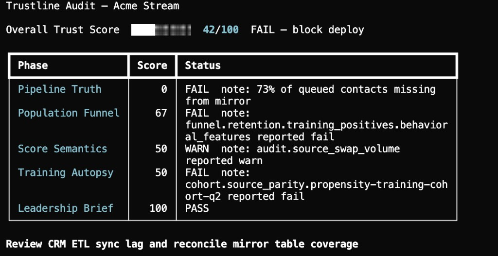

# Trustline

[](https://github.com/omarfarooq908/trustline/actions/workflows/ci.yml)
[](https://pypi.org/project/trustline/)
[](LICENSE)
[](https://www.python.org/downloads/)

**Business systems fail at the boundaries. Trustline verifies the boundaries.**

Trustline compiles YAML contracts into SQL checks and produces a measurable integrity scorecard. See [Why Trustline](docs/why-trustline.md) for the seam problem and compiler model.

## Quickstart

```bash
pip install trustline
trustline audit --demo
```

The demo audit exits `1` — seeded failures are intentional. See [ACME demo](docs/acme-demo.md).

Scaffold contracts for your product:

```bash
trustline init --preset ml-crm-boundary --non-interactive
trustline validate --contracts ./trustline/contracts
```

Contributors: clone the repo and run `make install-dev`. See [Getting Started](docs/getting-started.md).



## When to use Trustline

Use Trustline when you need to **verify seams** between systems — not to orchestrate pipelines or train models:

| Scenario | Init preset |
|----------|-------------|
| ML scores must land in CRM with expected coverage | `ml-crm-boundary` |
| Training and scoring read from different feature tables | `cohort-source-parity` |
| Identity funnel retention drops across join stages | `funnel-retention` |
| Block merges on invalid contract YAML in CI | `trustline validate` (no preset) |

List presets: `trustline init --list-presets`. Pattern details: [Patterns](docs/patterns/README.md). Walkthroughs: [Use cases](docs/use-cases.md).

## What Trustline is not

- **Not an orchestrator** — integrates with Airflow and Dagster; does not replace them
- **Not a transform framework** — extends dbt; does not replace it
- **Not a model training runtime** — no training, inference, or feature store
- **Not a hosted SaaS** — CLI you run in CI or on a schedule
- **Not auto-remediation** — detects and reports; never auto-fixes

## Documentation

| Document | Description |
|----------|-------------|
| [Why Trustline](docs/why-trustline.md) | Problem statement and compiler model |
| [Patterns](docs/patterns/README.md) | Boundary failure catalog |
| [Use cases](docs/use-cases.md) | Common adoption walkthroughs |
| [Stability](docs/STABILITY.md) | Contract and CLI semver policy |
| [Getting Started](docs/getting-started.md) | Install, quick start, CLI |
| [ACME demo](docs/acme-demo.md) | Bundled fixture and `--demo` |
| [Overview](docs/index.md) | Commands, phases, architecture |
| [Contract Spec](docs/contract-spec.md) | YAML schema |
| [Roadmap](docs/roadmap.md) | Planned versions |
| [Examples](examples/templates/README.md) | Init presets and templates |
| [Contributing](docs/contributing.md) | Development |

## Development

```bash
make check    # format, lint, types, tests, coverage
make test
```

## License

[Apache 2.0](LICENSE)
