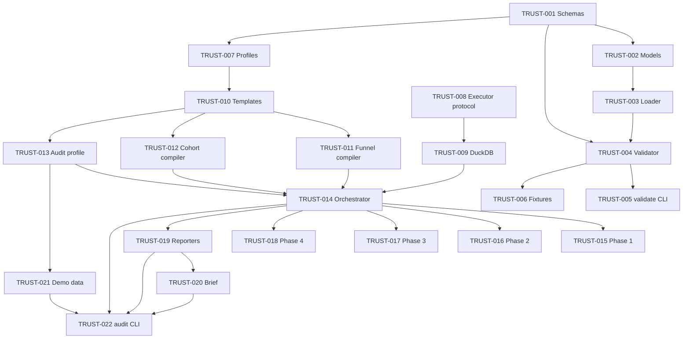

# Trustline v0.1 — Milestones

GitHub-issue-ready tasks for Trustline v0.1 MVP implementation.

**Master plan:** [IMPLEMENTATION_PLAN.md](IMPLEMENTATION_PLAN.md)  
**Scope:** [mvp-scope.md](mvp-scope.md)

Do not create GitHub issues automatically from this file. Copy task blocks into issues as work begins.

---

## Phase 1 — Contract load + validate

### TRUST-001: JSON Schema files

**Phase:** 1  
**Files:** `schemas/common.schema.json`, `schemas/funnel.schema.json`, `schemas/cohort.schema.json`  
**Acceptance criteria:**

- [ ] Schemas extracted from [contract-spec.md](contract-spec.md) into standalone files
- [ ] `common.schema.json` holds shared `$defs/metadata` referenced by funnel and cohort
- [ ] Schemas validate with `jsonschema` draft 2020-12
- [ ] `make check` passes

**Depends on:** none

---

### TRUST-002: Pydantic contract models

**Phase:** 1  
**Files:** `src/trustline/contracts/models.py`, `tests/unit/contracts/test_models.py`  
**Acceptance criteria:**

- [ ] `FunnelContract`, `CohortManifest`, and shared metadata models defined
- [ ] Field aliases map `apiVersion` → `api_version`
- [ ] Semantic validation: unique stage names; outcome window after observation window
- [ ] `make check` passes

**Depends on:** TRUST-001

---

### TRUST-003: Contract YAML loader

**Phase:** 1  
**Files:** `src/trustline/contracts/loader.py`, `tests/unit/contracts/test_loader.py`  
**Acceptance criteria:**

- [ ] `load_contract(path)` loads valid ACME funnel from `examples/acme_stream/contracts/`
- [ ] `load_contracts_dir(directory)` globs `*.yaml` and returns typed list
- [ ] Raises `ValidationError` on malformed YAML
- [ ] Raises `FileNotFoundError` on missing path
- [ ] `make check` passes

**Depends on:** TRUST-002

---

### TRUST-004: JSON Schema validator

**Phase:** 1  
**Files:** `src/trustline/contracts/validator.py`, `tests/unit/contracts/test_validator.py`  
**Acceptance criteria:**

- [ ] `validate_contract_strict(doc)` returns `ContractDocument` for valid input
- [ ] Raises `ValidationError` with field paths on schema failure
- [ ] `validate_contracts_dir` returns `ValidationSummary` with per-file results
- [ ] Valid ACME contracts pass; invalid fixtures fail
- [ ] `make check` passes

**Depends on:** TRUST-001, TRUST-003

---

### TRUST-005: `trustline validate` CLI

**Phase:** 1  
**Files:** `src/trustline/cli/validate.py`, `tests/unit/cli/test_validate.py`, `pyproject.toml`  
**Acceptance criteria:**

- [ ] `trustline validate --contracts ./examples/acme_stream/contracts/` exits 0
- [ ] Invalid contracts exit 1 with stderr details
- [ ] Bad directory path exits 2
- [ ] `--file` validates single contract
- [ ] `make check` passes

**Depends on:** TRUST-004

---

### TRUST-006: Invalid contract test fixtures

**Phase:** 1  
**Files:** `tests/fixtures/invalid_contracts/*.yaml`, `tests/fixtures/acme_contracts/`  
**Acceptance criteria:**

- [ ] At least 3 invalid fixtures: missing required field, bad threshold, wrong kind
- [ ] Valid ACME copies in `acme_contracts/` for unit tests
- [ ] CI fails validate on invalid fixtures when wired in tests
- [ ] `make check` passes

**Depends on:** TRUST-004

---

## Phase 2 — Config + DuckDB executor

### TRUST-007: Profile config loader

**Phase:** 2  
**Files:** `src/trustline/config.py`, `examples/acme_stream/profiles.yml.example`, `tests/unit/config/test_profiles.py`  
**Acceptance criteria:**

- [ ] `load_profile("default")` reads database, schema, duckdb_path
- [ ] Raises `TrustlineError` when profile name missing
- [ ] Raises `ValidationError` on malformed YAML
- [ ] `make check` passes

**Depends on:** TRUST-001

---

### TRUST-008: Executor protocol

**Phase:** 2  
**Files:** `src/trustline/executors/base.py`, `tests/unit/executors/test_base.py`  
**Acceptance criteria:**

- [ ] `Executor` protocol defines `execute` and `execute_check`
- [ ] `CheckResult` and `CompiledCheck` dataclasses defined
- [ ] Type-checks pass under mypy strict
- [ ] `make check` passes

**Depends on:** none

---

### TRUST-009: DuckDB executor

**Phase:** 2  
**Files:** `src/trustline/executors/duckdb.py`, `tests/unit/executors/test_duckdb.py`, `pyproject.toml`  
**Acceptance criteria:**

- [ ] `DuckDBExecutor(":memory:")` executes `SELECT 1` and returns `[{"1": 1}]`
- [ ] `execute_check` compares result to `CheckExpectation`
- [ ] Raises `ExecutorError` on SQL failure
- [ ] `duckdb` added to project dependencies
- [ ] `make check` passes

**Depends on:** TRUST-008

---

## Phase 3 — SQL compiler

### TRUST-010: Jinja2 SQL templates

**Phase:** 3  
**Files:** `templates/sql/*.sql.j2` (6 files), `src/trustline/compiler/templates.py`, `tests/unit/compiler/test_templates.py`  
**Acceptance criteria:**

- [ ] All 6 templates from [architecture.md](architecture.md) created
- [ ] Dialect conditionals for DuckDB vs Snowflake
- [ ] `render_template` loads from package-relative path
- [ ] `resolve_ref` converts `{{ ref('model') }}` to qualified table name
- [ ] `make check` passes

**Depends on:** TRUST-007

---

### TRUST-011: Funnel SQL compiler

**Phase:** 3  
**Files:** `src/trustline/compiler/funnel.py`, `tests/unit/compiler/test_funnel.py`, `tests/fixtures/sql_snapshots/`  
**Acceptance criteria:**

- [ ] `compile_funnel_checks` emits stage count + retention checks per stage
- [ ] Snapshot test matches golden SQL for ACME funnel
- [ ] `make check` passes

**Depends on:** TRUST-010, TRUST-002

---

### TRUST-012: Cohort SQL compiler

**Phase:** 3  
**Files:** `src/trustline/compiler/cohort.py`, `tests/unit/compiler/test_cohort.py`  
**Acceptance criteria:**

- [ ] `compile_cohort_checks` emits source parity + positive rate checks
- [ ] Snapshot test for ACME cohort contract
- [ ] `make check` passes

**Depends on:** TRUST-010, TRUST-002

---

### TRUST-013: Audit profile schema + compiler

**Phase:** 3  
**Files:** `schemas/audit_profile.schema.json`, `src/trustline/compiler/audit_profile.py`, `examples/acme_stream/audit_profile.yaml`, `tests/unit/compiler/test_audit_profile.py`  
**Acceptance criteria:**

- [ ] `audit_profile.schema.json` validates CRM coverage + source swap fields
- [ ] `compile_audit_profile_checks` emits Phase 1 + Phase 3 SQL
- [ ] Example file uses ACME Stream synthetic table refs only
- [ ] `make check` passes

**Depends on:** TRUST-010, ADR-019

---

## Phase 4 — Scorecard engine

### TRUST-014: Scorecard orchestrator

**Phase:** 4  
**Files:** `src/trustline/scorecard/orchestrator.py`, `tests/unit/scorecard/test_orchestrator.py`  
**Acceptance criteria:**

- [ ] `run_audit` executes phases 1–4 sequentially
- [ ] Verdict: FAIL if any phase fails; WARN if warnings only; PASS otherwise
- [ ] Returns `ScorecardResult` with evidence dict
- [ ] `make check` passes

**Depends on:** TRUST-011, TRUST-012, TRUST-013, TRUST-009

---

### TRUST-015: Phase 1 pipeline checks

**Phase:** 4  
**Files:** `src/trustline/scorecard/phase1_pipeline.py`, `tests/unit/scorecard/test_phase1_pipeline.py`  
**Acceptance criteria:**

- [ ] CRM coverage gap check runs against audit profile
- [ ] FAIL when sync_pct below `expect_sync_pct`
- [ ] `make check` passes

**Depends on:** TRUST-013, TRUST-014

---

### TRUST-016: Phase 2 funnel checks

**Phase:** 4  
**Files:** `src/trustline/scorecard/phase2_funnel.py`, `tests/unit/scorecard/test_phase2_funnel.py`  
**Acceptance criteria:**

- [ ] Stage count and retention checks evaluate against funnel contract
- [ ] FAIL on retention below threshold (ACME failure #1)
- [ ] `make check` passes

**Depends on:** TRUST-011, TRUST-014

---

### TRUST-017: Phase 3 semantics checks

**Phase:** 4  
**Files:** `src/trustline/scorecard/phase3_semantics.py`, `tests/unit/scorecard/test_phase3_semantics.py`  
**Acceptance criteria:**

- [ ] Source swap volume drift returns WARN when above threshold (ACME failure #3)
- [ ] Score distribution check included
- [ ] `make check` passes

**Depends on:** TRUST-013, TRUST-014

---

### TRUST-018: Phase 4 training autopsy checks

**Phase:** 4  
**Files:** `src/trustline/scorecard/phase4_training.py`, `tests/unit/scorecard/test_phase4_training.py`  
**Acceptance criteria:**

- [ ] Cohort source parity FAIL on training ≠ scoring source (ACME failure #2)
- [ ] Positive rate tolerance check included
- [ ] `make check` passes

**Depends on:** TRUST-012, TRUST-014

---

## Phase 5 — Reporters

### TRUST-019: Markdown and JSON reporters

**Phase:** 5  
**Files:** `src/trustline/reporters/markdown.py`, `src/trustline/reporters/json_report.py`, `tests/unit/reporters/test_markdown.py`, `tests/unit/reporters/test_json_report.py`  
**Acceptance criteria:**

- [ ] `render_scorecard` produces human-readable markdown with phase summary
- [ ] `render_scorecard_json` produces JSON matching CLI output contract
- [ ] Connection strings redacted from evidence
- [ ] `make check` passes

**Depends on:** TRUST-014

---

### TRUST-020: Phase 5 leadership brief

**Phase:** 5  
**Files:** `src/trustline/scorecard/phase5_brief.py`, `src/trustline/reporters/brief.py`, `tests/unit/scorecard/test_phase5_brief.py`  
**Acceptance criteria:**

- [ ] Phase 5 aggregates prior phase results (no SQL execution)
- [ ] Brief lists top risks and recommended actions
- [ ] `make check` passes

**Depends on:** TRUST-014, TRUST-019

---

## Phase 6 — E2E audit

### TRUST-021: ACME demo data + `demo.duckdb`

**Phase:** 6  
**Files:** `examples/acme_stream/contracts/propensity_training_cohort_q2.yaml`, `examples/acme_stream/sql/seed_data.sql`, `examples/acme_stream/demo.duckdb`, `tests/fixtures/acme_funnel_mock_results.json`  
**Acceptance criteria:**

- [ ] Seed data produces all 4 failure modes (P1 FAIL, P2 FAIL, P3 WARN, P4 FAIL)
- [ ] `demo.duckdb` committed and < 500KB
- [ ] Cohort contract matches [contract-spec.md](contract-spec.md) example 2
- [ ] `make check` passes

**Depends on:** TRUST-013

---

### TRUST-022: `trustline audit` CLI + E2E test

**Phase:** 6  
**Files:** `src/trustline/cli/audit.py`, `tests/unit/cli/test_audit.py`, `tests/e2e/test_acme_audit.py`, `README.md`, `docs/getting-started.md`  
**Acceptance criteria:**

- [ ] `trustline audit --contracts ./examples/acme_stream/contracts/ --target duckdb` exits 1
- [ ] `test_four_seeded_failures` asserts all 4 failure modes
- [ ] `--output-dir` writes `scorecard.md` and `scorecard.json`
- [ ] `--dry-run` compiles without executing
- [ ] README quickstart is copy-paste accurate
- [ ] `make check` passes

**Depends on:** TRUST-014, TRUST-019, TRUST-020, TRUST-021

---

## Stretch tasks (post-TRUST-022)

These are not numbered TRUST issues but tracked in [IMPLEMENTATION_PLAN.md](IMPLEMENTATION_PLAN.md) Phases 7–8:

| Task | Phase | Summary |
|------|-------|---------|
| Snowflake executor | 7 | `executors/snowflake.py`; integration test skipped in CI |
| GitHub Actions example | 8 | `integrations/github-actions/trustline-audit.yml` |
| Slack notification | 8 | `--notify slack` in audit CLI |
| Coverage bump to 90% | 8 | Before v0.1.0 tag |

---

## Task dependency graph

---

## Exit criteria mapping

| MVP exit criterion | Tasks |
|--------------------|-------|
| 1. ACME demo < 5 min | TRUST-021, TRUST-022 |
| 2. 4 seeded failures detected | TRUST-021, TRUST-022 |
| 3. Valid contracts pass validate | TRUST-004, TRUST-005 |
| 4. Broken contracts fail validate | TRUST-006 |
| 5. Audit exits non-zero on failure | TRUST-022 |
| 6. Markdown + JSON reports | TRUST-019 |
| 7. README quickstart accurate | TRUST-022 |
