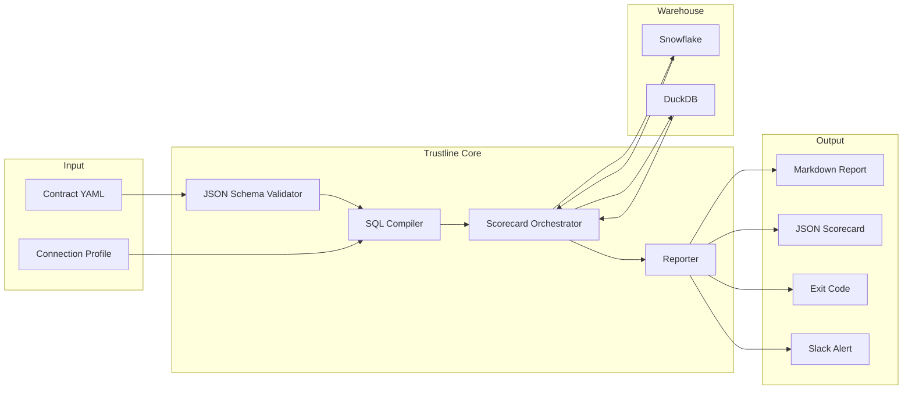
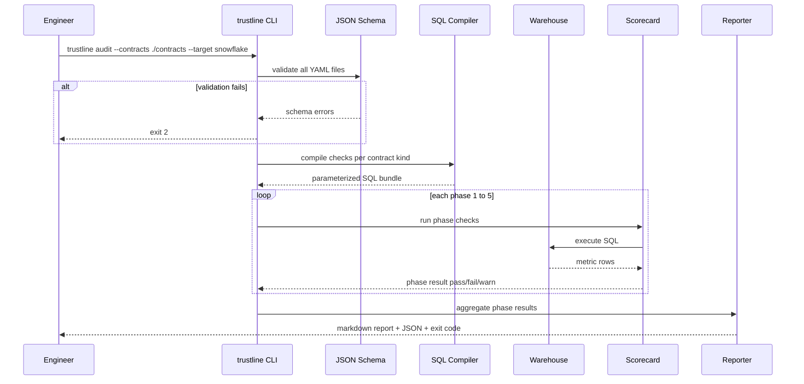
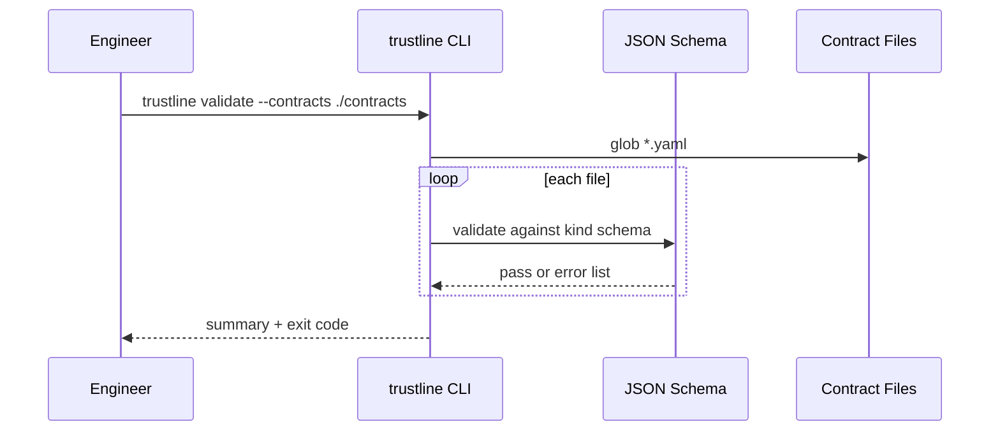
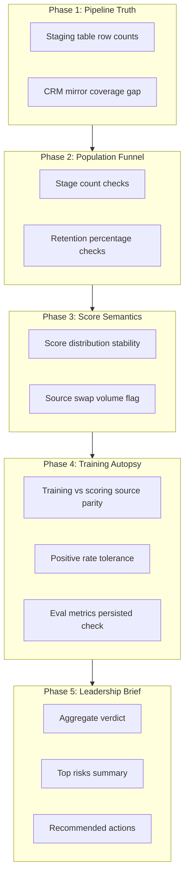

# Architecture — Trustline

This document describes the technical architecture for Trustline: repository structure, data flow from contracts to scorecard, integration points, and warehouse adapter strategy.

---

## Design Principles

1. **Seam-first** — Components are organized around cross-boundary checks, not around individual tools.
2. **Contract-driven** — YAML contracts are the source of truth; SQL checks are compiled artifacts.
3. **Adapter isolation** — Warehouse-specific SQL lives in adapters and Jinja2 templates, not in core logic.
4. **CLI-first** — The command line is the primary interface; library API and web UI come later.
5. **Offline-capable** — DuckDB local mode enables demo and CI without warehouse credentials.

---

## Repository Structure

### Current (v0.0.1 scaffold)

```
trustline/
├── pyproject.toml
├── Makefile
├── src/trustline/          # CLI stubs (validate, audit)
├── tests/
├── schemas/                # placeholder until Phase 1
├── examples/acme_stream/
├── integrations/           # dbt, GitHub Actions stubs
└── docs/
```

### Target (v0.1 MVP)

```
trustline/
├── pyproject.toml
├── src/
│   └── trustline/
│       ├── __init__.py
│       ├── cli/
│       │   ├── __init__.py
│       │   ├── main.py              # typer app entrypoint
│       │   ├── validate.py          # trustline validate
│       │   └── audit.py             # trustline audit
│       ├── contracts/
│       │   ├── __init__.py
│       │   ├── loader.py            # YAML load + parse
│       │   ├── validator.py         # JSON Schema validation
│       │   └── models.py            # Pydantic/dataclass models
│       ├── compiler/
│       │   ├── __init__.py
│       │   ├── funnel.py            # FunnelContract → SQL
│       │   ├── cohort.py            # CohortManifest → SQL
│       │   └── templates.py         # Jinja2 template rendering
│       ├── executors/
│       │   ├── __init__.py
│       │   ├── base.py              # Abstract executor interface
│       │   ├── snowflake.py         # Snowflake connector
│       │   └── duckdb.py            # DuckDB local executor
│       ├── scorecard/
│       │   ├── __init__.py
│       │   ├── orchestrator.py      # 5-phase audit runner
│       │   ├── phase1_pipeline.py
│       │   ├── phase2_funnel.py
│       │   ├── phase3_semantics.py
│       │   ├── phase4_training.py
│       │   └── phase5_brief.py
│       ├── reporters/
│       │   ├── __init__.py
│       │   ├── markdown.py
│       │   ├── json_report.py
│       │   └── brief.py             # Leadership brief template
│       └── integrations/
│           ├── __init__.py
│           ├── slack.py
│           └── github_actions.py
├── schemas/
│   ├── funnel.schema.json
│   ├── cohort.schema.json
│   └── common.schema.json           # Shared definitions
├── templates/
│   └── sql/
│       ├── funnel_stage_count.sql.j2
│       ├── funnel_retention.sql.j2
│       ├── cohort_source_parity.sql.j2
│       ├── score_distribution.sql.j2
│       ├── crm_coverage_gap.sql.j2
│       └── source_swap_volume.sql.j2
├── examples/
│   └── acme_stream/
│       ├── contracts/
│       │   ├── training_positives.yaml
│       │   ├── propensity_cohort_q2.yaml
│       │   └── source_swap_newplayer.yaml
│       ├── sql/
│       │   └── seed_data.sql
│       ├── profiles.yml.example
│       └── demo.duckdb
├── integrations/
│   ├── dbt/
│   │   └── macros/
│   │       └── trustline_funnel.sql  # v0.2
│   └── github-actions/
│       └── trustline-audit.yml
├── tests/
│   ├── test_validate.py
│   ├── test_compiler.py
│   ├── test_scorecard.py
│   └── fixtures/
│       └── acme_contracts/
└── docs/
    └── ...
```

---

## Data Flow

### End-to-end: contract to scorecard



### Sequence: `trustline audit`



### Sequence: `trustline validate`



---

## Component Details

### Contract loader and validator

- Loads YAML files from a directory or glob pattern
- Identifies contract `kind` field (`FunnelContract`, `CohortManifest`)
- Validates against corresponding JSON Schema in `schemas/`
- Returns typed Python objects for compiler and scorecard

### SQL compiler

- Takes validated contract objects and renders Jinja2 SQL templates
- Resolves `{{ ref('model_name') }}` to fully qualified table names via profile config
- Produces a **check bundle**: ordered list of SQL statements with expected result metadata

Example compilation:

```
FunnelContract(training_positives)
  → funnel_stage_count.sql.j2  (stage: source_donors, expect_min: 2000)
  → funnel_retention.sql.j2    (stage: app_identity_match, expect_pct: 40)
  → funnel_retention.sql.j2    (stage: behavioral_features, expect_pct: 25)
```

### Scorecard orchestrator

Runs five phases sequentially. Each phase:

1. Selects relevant checks from the compiled bundle
2. Executes SQL via the warehouse adapter
3. Compares results against contract thresholds
4. Returns `pass`, `fail`, or `warn` with evidence

Overall verdict: **FAIL** if any phase fails; **WARN** if no failures but warnings exist; **PASS** otherwise.

### Warehouse executors

Abstract interface:

```python
class Executor(Protocol):
    def execute(self, sql: str) -> list[dict]: ...
    def execute_many(self, checks: list[Check]) -> list[CheckResult]: ...
```

| Adapter | Connection | Use case |
|---------|------------|----------|
| `DuckDBExecutor` | Local file (`demo.duckdb`) | Demo, CI, offline development |
| `SnowflakeExecutor` | `snowflake-connector-python` | Production audits |

Connection config via environment variables or `profiles.yml`:

```yaml
# profiles.yml.example
acme_prod:
  target: snowflake
  account: acme_stream
  database: ANALYTICS
  schema: ML_STAGING
  warehouse: COMPUTE_WH
```

### Reporters

| Format | Output | Consumer |
|--------|--------|----------|
| Markdown | `scorecard.md` | Engineers, data leads |
| JSON | `scorecard.json` | CI systems, dashboards |
| Brief | `brief.md` (Phase 5 only) | Executive stakeholders |

---

## Five-Phase Scorecard Architecture



### Phase-to-contract mapping

| Phase | Contract kinds consumed | SQL templates |
|-------|------------------------|---------------|
| 1 | `DeliveryLineageContract` (v0.3), staging table refs | `crm_coverage_gap.sql.j2` |
| 2 | `FunnelContract` | `funnel_stage_count.sql.j2`, `funnel_retention.sql.j2` |
| 3 | `SourceSwapAnnotation` (v0.2), score table refs | `score_distribution.sql.j2`, `source_swap_volume.sql.j2` |
| 4 | `CohortManifest` | `cohort_source_parity.sql.j2` |
| 5 | All phase results | Template-only (no SQL) |

---

## Integration Points

### dbt

| Version | Integration |
|---------|-------------|
| v0.1 | Document `{{ ref('model_name') }}` convention in contracts; manual table name resolution via profiles |
| v0.2 | `trustline_funnel` dbt macro generates funnel stage SQL from contract YAML |
| v0.3 | dbt Cloud CI hook runs `trustline validate` on model changes |

The dbt macro (v0.2) will live in `integrations/dbt/macros/trustline_funnel.sql` and accept a funnel contract as a var.

### Airflow

| Version | Integration |
|---------|-------------|
| v0.1 | None — run `trustline audit` as BashOperator manually |
| v0.3 | `TrustlineAuditOperator` — passes contracts dir, target profile, fails task on non-zero exit |

```python
# v0.3 example (not implemented in v0.1)
TrustlineAuditOperator(
    task_id="trust_audit",
    contracts_dir="/opt/airflow/dags/contracts/",
    target="snowflake",
    profile="acme_prod",
)
```

### GitHub Actions

v0.1 example workflow (`integrations/github-actions/trustline-audit.yml`):

```yaml
name: Trustline Audit
on: [pull_request]
jobs:
  audit:
    runs-on: ubuntu-latest
    steps:
      - uses: actions/checkout@v4
      - uses: actions/setup-python@v5
        with:
          python-version: "3.11"
      - run: pip install trustline
      - run: trustline validate --contracts ./examples/acme_stream/contracts/
      - run: trustline audit --contracts ./examples/acme_stream/contracts/ --target duckdb
```

v0.2 enhancement: PR comment with scorecard summary.

### Slack

v0.1: `--notify slack` flag posts webhook on audit failure.

```bash
trustline audit --contracts ./contracts/ --notify slack --slack-webhook $SLACK_WEBHOOK_URL
```

v0.2: Contract-level alert rules (`alerts.notify: slack`) with configurable channels.

---

## Warehouse Adapter Strategy

### v0.1: Snowflake + DuckDB

| Concern | Snowflake | DuckDB |
|---------|-----------|--------|
| Connection | `snowflake-connector-python` | `duckdb` Python package |
| SQL dialect | Snowflake SQL | DuckDB SQL (SQLite-compatible) |
| CI usage | Optional (requires secrets) | Primary (no secrets) |
| Demo | `examples/acme_stream/` DDL provided | `demo.duckdb` committed |

SQL templates use Jinja2 conditionals for dialect differences:

```sql
-- funnel_stage_count.sql.j2
SELECT COUNT(*) AS stage_count
FROM {{ table_ref }}

  WHERE _loaded_at >= DATEADD(day, -7, CURRENT_TIMESTAMP())

  WHERE _loaded_at >= CURRENT_TIMESTAMP - INTERVAL 7 DAY

```

### v0.2: BigQuery + Postgres

| Adapter | Driver | Notes |
|---------|--------|-------|
| `BigQueryExecutor` | `google-cloud-bigquery` | Parameterized queries; dataset refs |
| `PostgresExecutor` | `psycopg2` | For smaller teams without Snowflake |

Adapter interface remains unchanged; new adapters implement `Executor` protocol.

---

## Security Considerations

| Concern | Mitigation |
|---------|------------|
| Warehouse credentials | Environment variables or `profiles.yml` (gitignored); never in contracts |
| SQL injection | Contracts use `ref()` indirection; no raw user SQL in v0.1 CLI args |
| Secret leakage in reports | Scorecard redacts connection strings; evidence shows table names only |
| Demo data | Fictional ACME Stream dataset; see [contributing.md](contributing.md) for fixture conventions |

---

## Deployment Model

Trustline is a **CLI tool**, not a hosted service. Deployment options:

| Model | Description |
|-------|-------------|
| Local dev | `pip install -e .` + DuckDB demo |
| CI/CD | GitHub Actions runs validate + audit on every PR |
| Scheduled audit | Airflow BashOperator or cron (v0.3 operator) |
| Pre-deploy gate | `trustline audit` before CRM push DAG runs |

No server, no database, no infrastructure to operate beyond the warehouse connection.

---

## Related Documents

- [index.md](index.md) — Overview
- [mvp-scope.md](mvp-scope.md) — v0.1 scope and milestones
- [contract-spec.md](contract-spec.md) — Contract YAML specification
- [roadmap.md](roadmap.md) — Version roadmap
