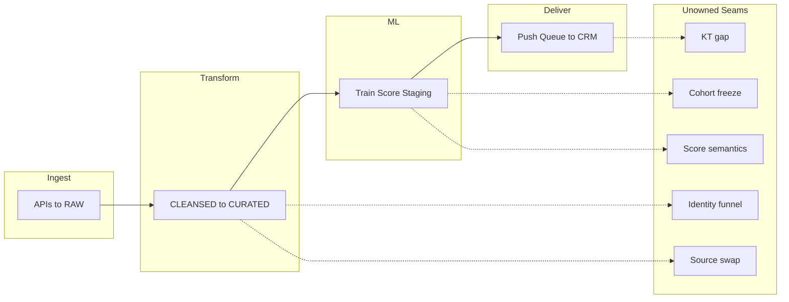
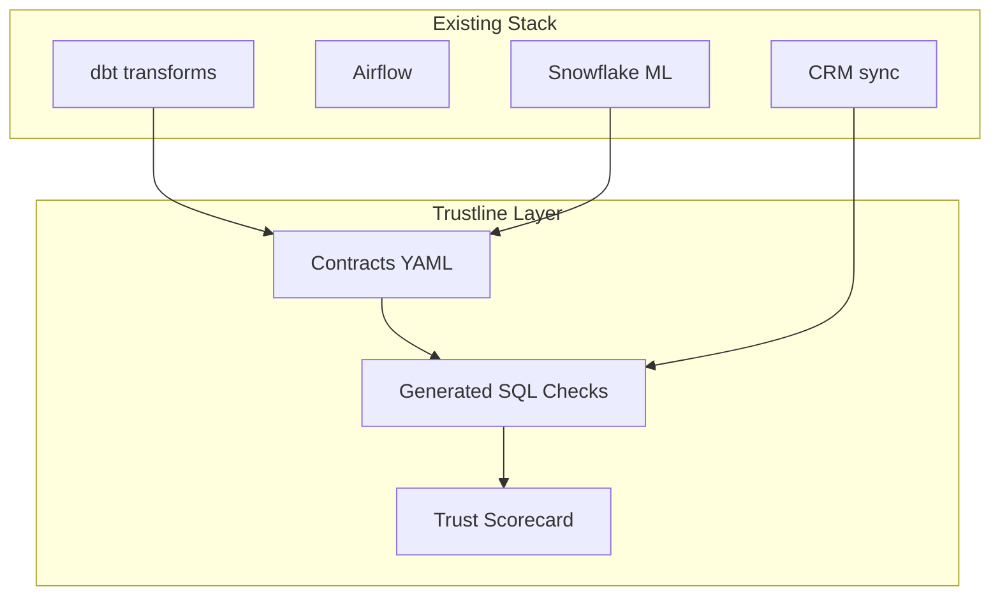

# Trustline — Data Product Trust Layer

Trustline is an open-source trust layer for data products. It sits on top of dbt, Airflow, Snowflake ML, and CRM sync tools — making cross-boundary product health **machine-checkable, versioned in git, and transferable**.

| Field | Value |
|-------|-------|
| Repository | `github.com/omarfarooq908/trustline` |
| License | Apache 2.0 |

## Executive summary

Data platform teams ship ML-facing products by stitching together best-in-class tools. Each tool succeeds within its boundary. The failures that erode stakeholder trust live in the **seams** — identity resolution across models, cohort freezing semantics, upstream source swaps, score interpretation, and the gap between a push queue and authoritative CRM state.

Trustline does not replace dbt, Airflow, or Snowflake ML. It extends them with:

- **Identity Funnel Contracts** — multi-hop join stages with retention thresholds
- **Cohort Manifests** — frozen observation/outcome windows and label definitions
- **Trust Scorecard CLI** — five-phase audit with pass/fail verdict
- **Transfer Pack** (planned) — runbook generated from repo state when owners leave

**What we are not building:** another orchestrator, transform framework, or notebook runtime.

> Trustline turns the unowned seams between warehouse transforms, ML pipelines, and CRM delivery into versioned, machine-checkable contracts — so "the DAG is green" can mean your stakeholders trust the numbers.

## Problem: ACME Stream (fictional)

ACME Stream is a fictional streaming video company. Their data platform shipped a CRM-facing propensity product end-to-end. Every tool worked in its slice. Nobody owned the seams.

| Dimension | Value |
|-----------|-------|
| App users | ~10M |
| Scoreable population | ~300K |
| CRM contacts with scores | ~80K |

| Phase | What failed at the seam |
|-------|-------------------------|
| Transform (dbt) | Identity funnel collapse (2,000 donors → 800 app matches → 250 with watch features) invisible to row/column tests |
| ML (Snowflake) | Training source ≠ scoring source; eval metrics not persisted |
| Delivery (CRM sync) | 300K rows queued vs 80K contacts in mirror — queue mistaken for authoritative state |
| Knowledge transfer | Notion doc existed; no executable contract in git |

## Solution overview

| Component | Description |
|-----------|-------------|
| Contract spec | YAML contracts for funnels, cohorts, source swaps |
| SQL check compiler | Contract → parameterized warehouse checks |
| Trust Scorecard CLI | Five-phase audit orchestrator |
| Demo dataset | Synthetic ACME Stream with seeded failures |

## User stories

| Persona | Goal |
|---------|------|
| Platform engineer | Funnel contract with retention thresholds; CI fails when donor→app match drops below 40% |
| ML engineer | Frozen cohort manifest; detect when scoring source ≠ training source |
| Data lead | Run trust scorecard before CRM push; block deploy on seam failures |
| Executive stakeholder | Leadership brief with trust verdict and top risks |
| Onboarding engineer | Transfer pack from repo state when ML owner departs |
| Data analyst | Read cohort manifest for label definition and positive rate |
| SRE / on-call | Alert when source swap detector flags volume drift |
| Compliance reviewer | Audit ML delivery lineage from train bundle to CRM mirror |

## Learn more

| Document | Description |
|----------|-------------|
| [Getting Started](getting-started.md) | Install and first commands |
| [Contract Spec](contract-spec.md) | YAML contract API |
| [Architecture](architecture.md) | Technical design |
| [MVP Scope](mvp-scope.md) | v0.1 in/out of scope |
| [Roadmap](roadmap.md) | Feature roadmap |
| [Contributing](contributing.md) | Contributor guide |
