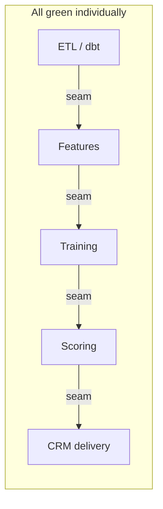

# Why Trustline

Business systems fail at the boundaries. Trustline verifies the boundaries.

---

## The seam problem

A team spent days debugging a production ML pipeline.

Nothing was technically broken. The pipeline succeeded. The model worked. The warehouse was healthy. Dashboards were green.

The business outcome was wrong.

Airflow reported success. dbt tests passed. Great Expectations found no anomalies. Offline model evaluation looked fine. Yet customers received scores for the wrong population, or no scores at all, or scores that no longer matched what the model was trained on.

The failure lived at a **seam** — the handoff between ETL and features, between training and scoring, between the sync queue and the CRM mirror. Each system validated itself. Nobody validated the boundary.



Trustline exists to make those seams machine-checkable.

---

## Implementation checks vs business invariants

Most validation today is **implementation logic**:

```python
assert count > 1000
```

```sql
SELECT COUNT(*) FROM table WHERE x IS NULL
```

Those answer: "Did this step run correctly?"

Trustline targets **business invariants** — statements about outcomes that must remain true across system boundaries:

> Every customer who receives an ML score must appear in the CRM mirror within the expected coverage threshold.

> The population used for training must match the population used for scoring.

> Identity funnel retention must not drop below the contracted threshold between stages.

In YAML, an audit profile expresses CRM coverage as a declarative invariant:

```yaml
crm_coverage:
  sync_table: "{{ ref('crm_push_queue') }}"
  mirror_table: "{{ ref('crm_contacts_mirror') }}"
  expect_sync_pct: 95
```

In plain English: *at least 95% of rows in the sync queue must appear in the CRM mirror.* That is business logic, not a row-count assertion on a single table.

A funnel contract expresses population invariants across join stages:

> 2,000 source donors → at least 40% matched to app identity → at least 25% with behavioral features.

See [contract-spec.md](contract-spec.md) and the [ACME Stream example](../examples/acme_stream/) for full contract examples.

---

## Compiler mental model

Trustline is not "another data quality tool." It is a **compiler**:


1. **Author** — write contracts in git (human-readable, reviewable)
2. **Validate** — `trustline validate` checks against JSON Schema in CI
3. **Compile** — Jinja2 templates turn contract `spec` into parameterized SQL
4. **Execute** — run checks against DuckDB (local/CI) or Snowflake (production)
5. **Report** — pass/fail/warn scorecard with Markdown, JSON, and leadership brief

Details: [architecture.md](architecture.md).

---

## Product Integrity Score

After an audit, Trustline produces a **Product Integrity Score** — a 0–100 aggregate derived from phases 1–4 (pipeline truth, population funnel, score semantics, training autopsy). Phase 5 is a leadership brief and does not affect the numeric score.

| Score range | Meaning |
|-------------|---------|
| 100 | All boundary checks passed |
| Partial | Some checks failed or warned; see per-phase evidence |
| Low | Multiple seam failures — block deployment |

**Note:** In v0.1, the CLI and JSON report still use the field name `trust_score`. A rename to `integrity_score` is planned for v0.2+ with semver deprecation. See [Terminology](contract-spec.md#terminology) in the contract spec.

---

## Related documents

| Document | Description |
|----------|-------------|
| [index.md](index.md) | Commands, phases, architecture overview |
| [contract-spec.md](contract-spec.md) | YAML schema and terminology |
| [roadmap.md](roadmap.md) | Version milestones and planned contract kinds |
